# LR6
## Лабораторная работа №6

### ***Порядок выполнения работы***
1. Создать аккаунт на сайте GitHub.

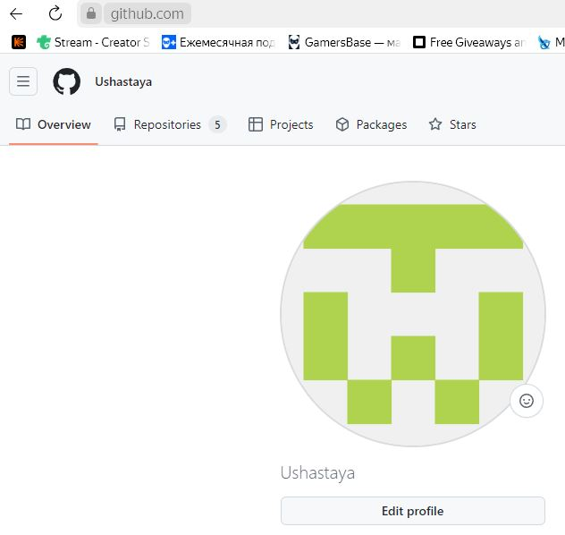

2. Сделать копию (Fork) в личное хранилище из 
```
https://github.com/Kurtyanik/LR6/
```

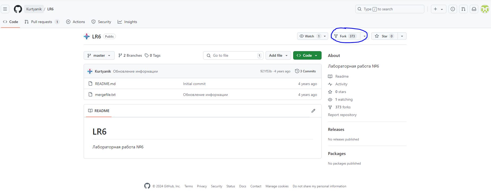

3. Установить Git 
4. После установки настроить клиент git, введя имя пользователя (Группа 
Фамилия И.О.) и email.

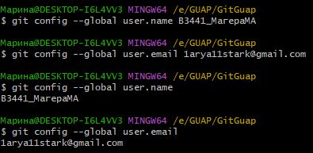

5. Клонировать свой личный удалённый репозиторий на компьютер.

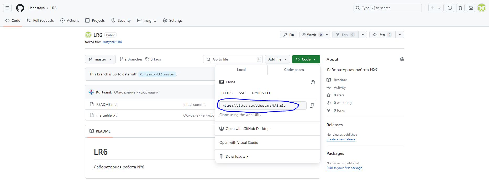

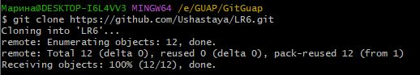

6. Добавить файл через интерфейс GitHub. Подтянуть изменения в 
локальный репозиторий.


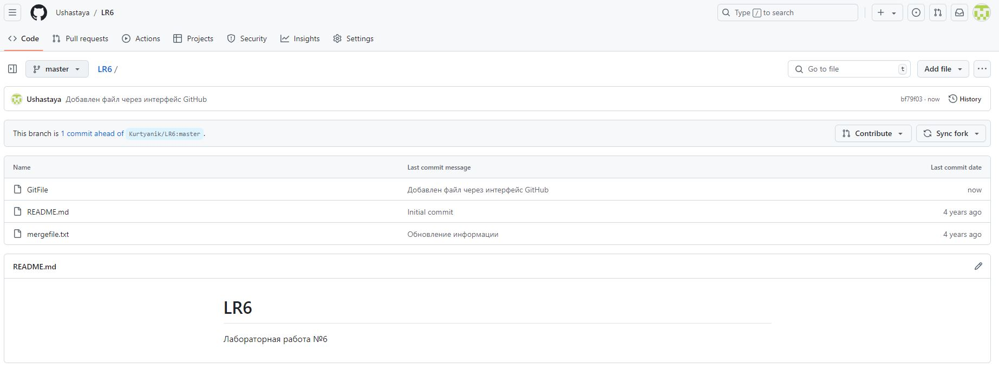

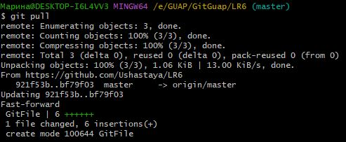

7. Получить историю операций для каждой из веток.

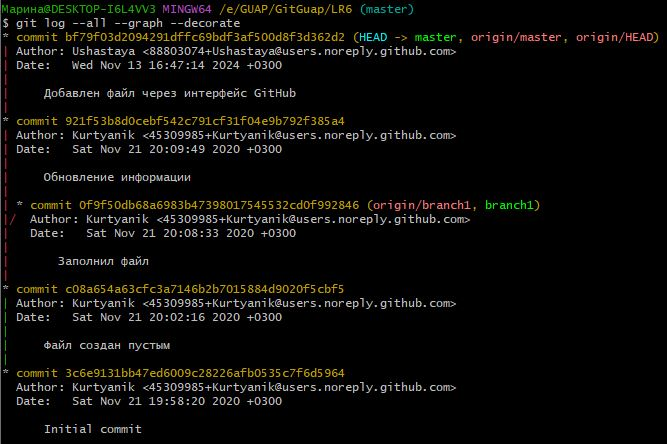

8. Просмотреть последние изменения.

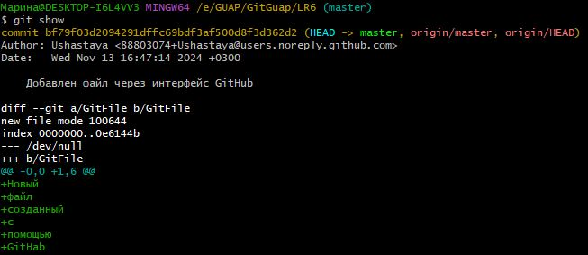

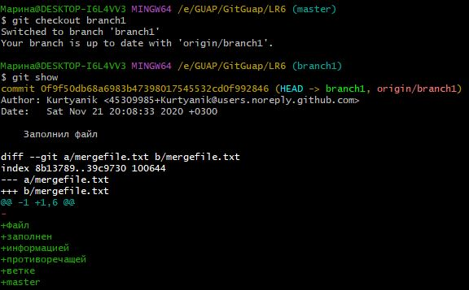

9. Выполнить слияние в ветку master, разрешив конфликт (можно 
использовать специальные редакторы или графический интерфейс git).

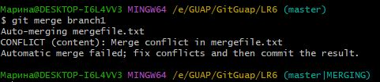

До редактирования:

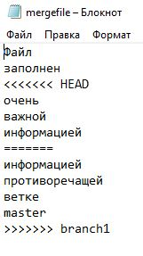

После редактирования:

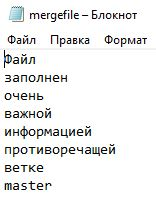

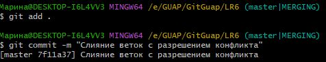

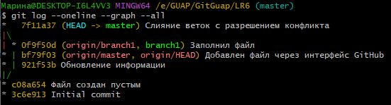

10. Удалить побочную ветку после успешного слияния.

Удаление в локальном репозитории.

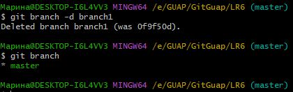

Удаление в удаленном репозитории.

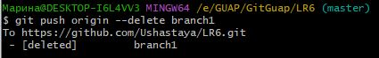

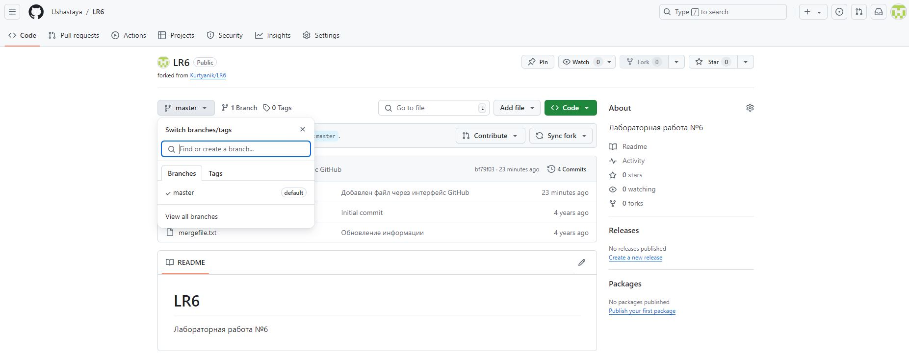

11. Сделать изменения и зафиксировать их, оставляя комментарии, 
несколько раз.

Первые изменения

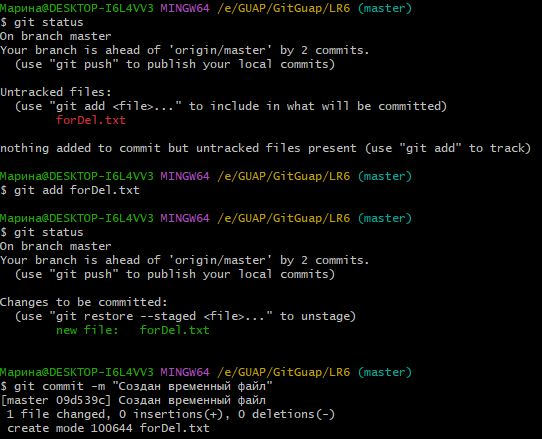

Вторые изменения

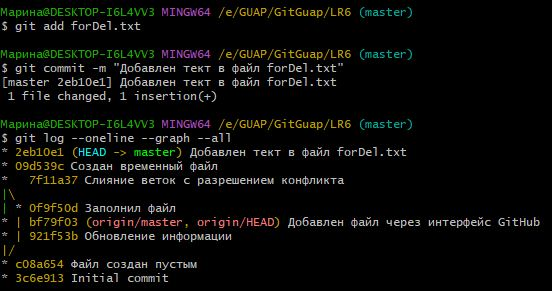

12. Сделать откат коммита.

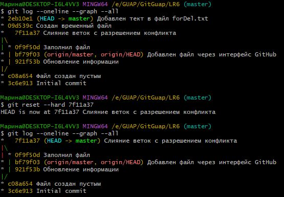

13. Создать ветку для отчёта.

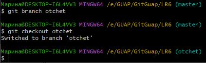

### Лог команд
```
git config --global user.name
git config --global user.email
git clone
git pull
git checkout <name branch>
git log --all --graph --decorate
git log --oneline --graph --all
git show
git merge <name branch>
git status
git add <file>
git add .
git commit -m "text commita"
git branch -d <name branch>
git push -d origin <name branch>
git reset --hard <hash commit>
git push
git push origin <name branch>
git log --pretty=format:"%h %ad %an %s" --date=short
```


### История операций

Вид: сокращённый хэш + дата + имя автора + комментарий

```
c073fdb 2024-11-13 В3441_МагераМА Добавила подписи мерджа
6c5c219 2024-11-13 В3441_МагераМА Подготовила для истории комитов зону GitHab
847aa91 2024-11-13 В3441_МагераМА Переименовала все картинки для отображения в GitHab
e8eec8f 2024-11-13 В3441_МагераМА Проверка отображения картинок для GitHab
e1e0b45 2024-11-13 В3441_МагераМА Добавлен лог команд
0597027 2024-11-13 В3441_МагераМА Добавлен 13 пункт ЛР
f3b4ce1 2024-11-13 В3441_МагераМА Добавлен 12 пункт ЛР
d18ea9e 2024-11-13 В3441_МагераМА Добавлен 11 пункт ЛР
4f6be8a 2024-11-13 В3441_МагераМА Добавлены изменения 10 пункт ЛР
706b087 2024-11-13 В3441_МагераМА Добавлен 10 пункт ЛР
48b4fa0 2024-11-13 В3441_МагераМА Добавлен 9 пункт ЛР
03d973c 2024-11-13 В3441_МагераМА Добавлен 8 пункт ЛР
c1a8b5f 2024-11-13 В3441_МагераМА Добавлен 7 пункт ЛР
8028a5a 2024-11-13 В3441_МагераМА Добавлен 6 пункт ЛР
8e085a4 2024-11-13 В3441_МагераМА Добавлен 5 пункт ЛР
7f37b57 2024-11-13 В3441_МагераМА Добавлены 3-4 пункты ЛР
2fc3ac1 2024-11-13 В3441_МагераМА Добавлен 2 пункт ЛР
3f1a4e9 2024-11-13 В3441_МагераМА Добавлен 1 пункт ЛР
e3b3bc5 2024-11-13 В3441_МагераМА Добавлены скриншоты выполнения ЛР6 в отдельную папку
7f11a37 2024-11-13 В3441_МагераМА Слияние веток с разрешением конфликта
bf79f03 2024-11-13 Ushastaya Добавлен файл через интерфейс GitHub
921f53b 2020-11-21 Kurtyanik Обновление информации
0f9f50d 2020-11-21 Kurtyanik Заполнил файл
c08a654 2020-11-21 Kurtyanik Файл создан пустым
3c6e913 2020-11-21 Kurtyanik Initial commit
```