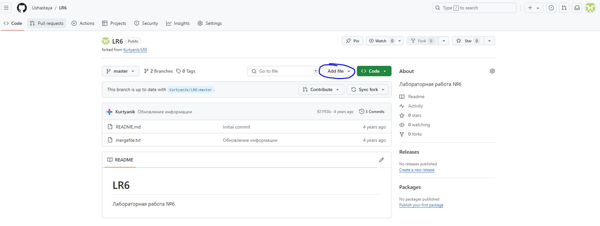

# LR6
## Лабораторная работа №6

### ***Порядок выполнения работы***
1. Создать аккаунт на сайте GitHub.


2. Сделать копию (Fork) в личное хранилище из 
```
https://github.com/Kurtyanik/LR6/
```


3. Установить Git 
4. После установки настроить клиент git, введя имя пользователя (Группа 
Фамилия И.О.) и email.


5. Клонировать свой личный удалённый репозиторий на компьютер.


6. Добавить файл через интерфейс GitHub. Подтянуть изменения в 
локальный репозиторий.




7. Получить историю операций для каждой из веток.


8. Просмотреть последние изменения.


9. Выполнить слияние в ветку master, разрешив конфликт (можно 
использовать специальные редакторы или графический интерфейс git).


10. Удалить побочную ветку после успешного слияния.

Удаление в локальном репозитории.


Удаление в удаленном репозитории.


11. Сделать изменения и зафиксировать их, оставляя комментарии, 
несколько раз.

Первые изменения


Вторые изменения


12. Сделать откат коммита.


13. Создать ветку для отчёта.


### Лог команд
```
git config --global user.name
git config --global user.email
git clone
git pull
git checkout <name branch>
git log --all --graph --decorate
git log --oneline --graph --all
git show
git merge <name branch>
git status
git add <file>
git add .
git commit -m "text commita"
git branch -d <name branch>
git push -d origin <name branch>
git reset --hard <hash commit>
git push
git push origin <name branch>
git log --pretty=format:"%h %ad %an %s" --date=short
```


### История операций
```

```